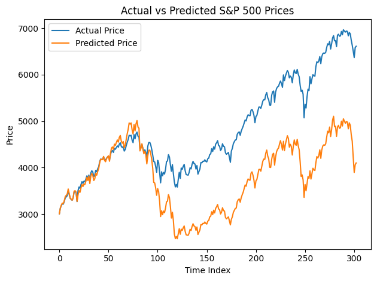

# Data preparation


```python
import json
import logging
from pymongo import MongoClient, errors

# set up logging 
logging.basicConfig(
    level=logging.INFO,
    format='%(asctime)s - %(levelname)s - %(message)s',
    filename='stock_pipeline.log',   # log file
    filemode='w'                     # overwrite each run
)

console = logging.StreamHandler()
console.setLevel(logging.INFO)
logging.getLogger().addHandler(console)

#load raw json
try:
    with open("stock.json") as f:
        raw = json.load(f)
    logging.info("Successfully loaded stock.json")
except FileNotFoundError:
    logging.error("stock.json file not found.")
    raise
except json.JSONDecodeError:
    logging.error("Error decoding JSON from stock.json.")
    raise

# flatten data
documents = []
try:
    for entry in raw["data"]:
        try:
            doc = {
                "symbol": raw.get("symbol", "UNKNOWN"),
                "name": raw.get("name", "UNKNOWN"),
                "interval": raw.get("interval", "UNKNOWN"),
                "date": entry["date"],
                "open": float(entry["open"]),
                "high": float(entry["high"]),
                "low": float(entry["low"]),
                "close": float(entry["close"])
            }
            documents.append(doc)
        except (KeyError, ValueError) as e:
            logging.warning(f"Skipping bad record: {entry} | Error: {e}")

    logging.info(f"Flattened {len(documents)} records successfully")

except Exception as e:
    logging.error(f"Unexpected error during flattening: {e}")
    raise

# save flattened version
try:
    with open("stock_flat.json", "w") as f:
        json.dump(documents, f, indent=2)
    logging.info("Saved flattened data to stock_flat.json")
except Exception as e:
    logging.error(f"Error saving flattened JSON: {e}")
    raise

# load into mongo
#!pip install pymongo
import os
from pymongo import MongoClient
import json

# saved uri as github codespaces secret
uri = os.getenv("MONGO_URI")
if uri is None:
    raise ValueError("MONGO_URI environment variable not set")

# connect to mongo
try:
    client = MongoClient(uri, serverSelectionTimeoutMS=5000)
    # test connection
    client.server_info()
    db = client["project2"]
    collection = db["stock_data"]
    logging.info("Connected to MongoDB successfully")

except errors.ServerSelectionTimeoutError:
    logging.error("Could not connect to MongoDB cluster.")
    raise

# insert data
try:
    # clear old data
    collection.drop()
    logging.info("Dropped existing collection")

    if len(documents) == 0:
        logging.warning("No documents to insert.")
    else:
        result = collection.insert_many(documents)
        logging.info(f"Inserted {len(result.inserted_ids)} documents")

except errors.BulkWriteError as e:
    logging.error(f"Bulk write error: {e.details}")
    raise
except Exception as e:
    logging.error(f"Error inserting data into MongoDB: {e}")
    raise

logging.info("Pipeline completed successfully!")
print("Data inserted successfully!")
```

    Successfully loaded stock.json
    Flattened 1519 records successfully
    Saved flattened data to stock_flat.json
    Connected to MongoDB successfully
    Dropped existing collection
    Inserted 1519 documents
    Pipeline completed successfully!


    Data inserted successfully!


# Solution Analysis


```python
# !pip install pandas
# !pip install numpy
# !pip install xgboost
# !pip install scikit-learn
import pandas as pd
import numpy as np
from xgboost import XGBRegressor 
from sklearn.metrics import mean_squared_error, r2_score
data = list(collection.find({}, {"_id": 0}))
df = pd.DataFrame(data)

# preprocessing
df['date'] = pd.to_datetime(df['date'])
df = df.sort_values(by='date')

# feature engineering (lags)
df['close_lag1'] = df['close'].shift(1)
df['close_lag2'] = df['close'].shift(2)
df['close_lag3'] = df['close'].shift(3)
# moving averages
df['ma_4'] = df['close'].rolling(4).mean()
df['ma_8'] = df['close'].rolling(8).mean()
# momentum
df['momentum_4'] = df['close'] - df['close_lag1']
# volatility
df['volatility_4'] = df['close'].rolling(4).std()
# calcualting return
df['return'] = df['close'].pct_change()
df = df.dropna()

# predictors and target
features = ['open', 'high', 'low', 
    'close_lag1', 'close_lag2', 'close_lag3',
    'ma_4', 'ma_8',
    'momentum_4',
    'volatility_4'
]
X = df[features]
y = df['return']

# forecasting split
split_index = int(len(df) * 0.8)
X_train, X_test = X[:split_index], X[split_index:]
y_train, y_test = y[:split_index], y[split_index:]

# xgb
model = XGBRegressor(
    n_estimators=100,
    max_depth=7,
    learning_rate=0.05,
    random_state=0
)

model.fit(X_train, y_train)

# predict
y_pred = model.predict(X_test)

# evaluate
rmse = np.sqrt(mean_squared_error(y_test, y_pred))
r2 = r2_score(y_test, y_pred)

print(f"RMSE: {rmse:.2f}")
print(f"R2 Score: {r2:.4f}")
```

    RMSE: 0.01
    R2 Score: 0.6960


**Analysis Rationale**

There were many decisions that went through this analysis process regarding preprocessing and modeling. For instance, feature engineering was implemented to include lagged features, aka previous closing prices, moving averages, momentum, and volatility to capture temporal trends. Instead of predicting raw prices, I chose to predict returns, which helps stabilize the data and reduce issues around long term market growth trends. I chose to implement a forecasting split to keep the sequential order of teh data, rather than a random train/test. Lastly, I chose to implement an XGBoost model because of its ability to capture nonlinear relationships between features. Overall, I found that it had strong predictive performance, as the R^2 score is relatively high for stock market applications. 

# Visualization


```python
#!pip install matplotlib
import matplotlib.pyplot as plt

# convert returns back to price for visualization
test_prices = df['close'].iloc[split_index:].reset_index(drop=True)
# reconstruct predicted prices
pred_prices = [test_prices.iloc[0]]

for i in range(1, len(y_pred)):
    next_price = pred_prices[i-1] * (1 + y_pred.iloc[i])
    pred_prices.append(next_price)

plt.figure()
plt.plot(test_prices, label='Actual Price')
plt.plot(pred_prices, label='Predicted Price')

plt.xlabel("Time Index")
plt.ylabel("Price")
plt.title("Actual vs Predicted S&P 500 Prices")
plt.legend()

plt.tight_layout()
plt.show()
```


    

    


**Visualization Rationale**

The goal of this visualization is to show the overall model predictions over time. I debated plotting predicted versus actual returns, but chose to reconstruct predicted prices from the returns instead. While the predicted versus actual returns would have directly reflected the actual predictions, it was harder to interpret at first glance. Thus, I transformed them back to prices to get a clearer picture against actual closing prices. We can see that for the first 90 days, the model is able to predict very well. However, after 100 days, the model starts to deviate largely from the actual closing prices. This shows us that this model is successful with short term forecasts, but long term forecasts may require more data or a more suitable model 
